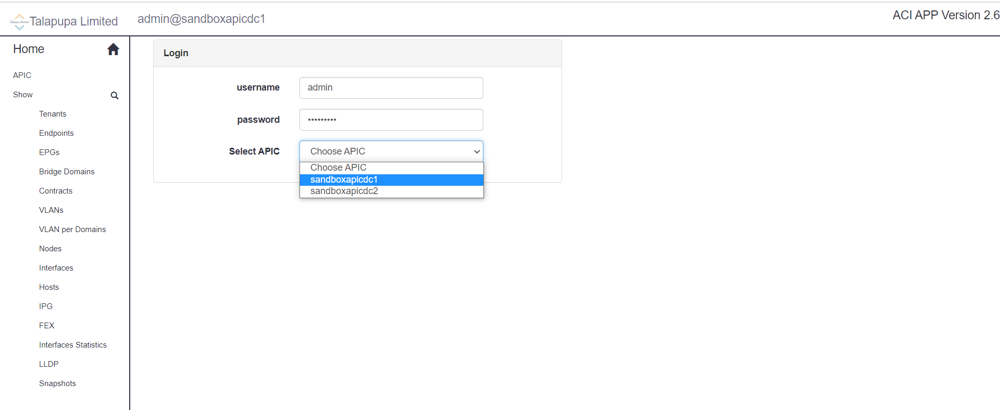
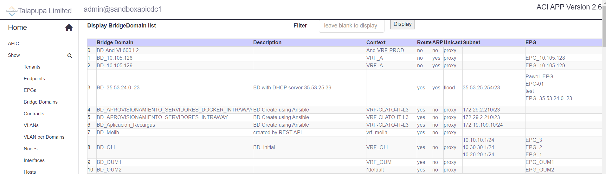
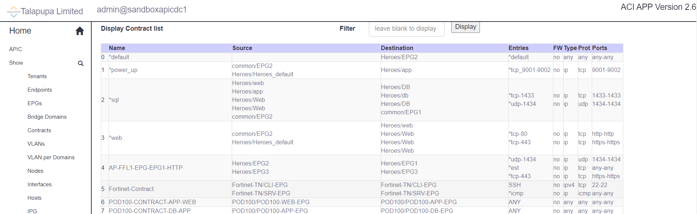
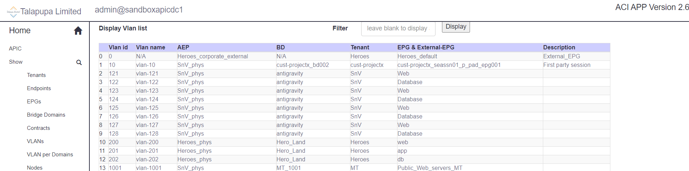
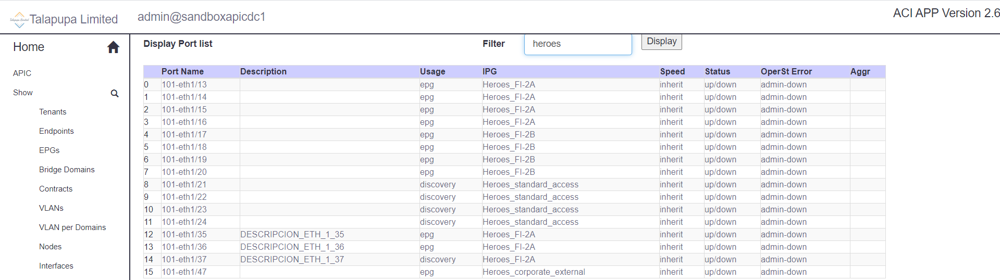
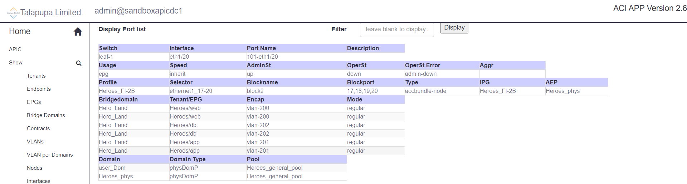

# aci_app_ro: The ACI APP readonly version

# Description

The ACI APP is NOT an automation tool, but rather a visual aid and verification tool which uses the apic northbound api.
It is limited in scope to common things I find useful and you will need a basic understanding of ACI to use it.

A running version is published at the following link: https://acicli.talapupa.com point to the Cisco's online Sandbox  APIC 
https://sandboxapicdc.cisco.com                                                                                  
username: admin                                                                                  
password: ciscopsdt                                                                                  

# Installation

Create virtual environtment virtualenv -p python3 env                                                                                                                                                                    
Activate the virtual environtment source env/bin/activate                                                                                  
Install the requirement package pip install -r requirements.txt                                                                                  
Run the project                                                                                  
cd aci_app_ro                                                                                  
python oneaciapp.py                                                                                  
Open browser and type localhost:8080                                                                                   

# Configuration
Edit apics.txt file and add addtional APIC FQDN or IP Address

# Usage
Login with username and password. Then select the APIC from the list.                                                                                  

Select from left side bar menu to show results of read only API queries to the APIC.                                                                                  

Use the search bar to filter result, click display to see the result                                                         

Click display objects names to display information about it                                                         

